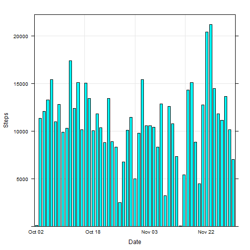
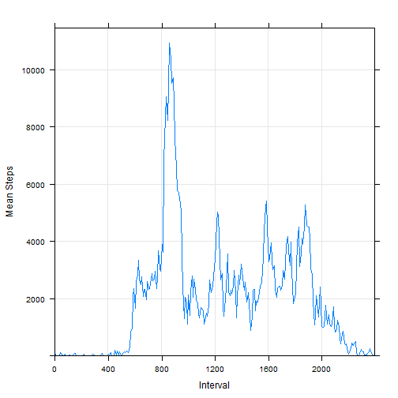
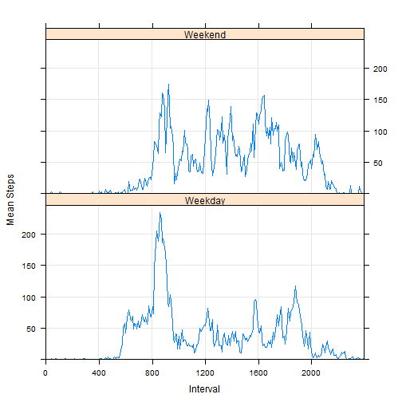

Eric Byrnes


## Abstract
This analysis is of personal activity data (steps) gathered from an activity monitoring device such as a
[Fitbit](http://www.fitbit.com), [Nike
Fuelband](http://www.nike.com/us/en_us/c/nikeplus-fuelband), or
[Jawbone Up](https://jawbone.com/up). The exact device used to collect the data was not specified. Data is collected in 5 minute increments (more precisely, the number of steps during each increment) between Oct. 1, 2012 and Nov. 30, 2012, inclusive. Unavailable data is removed or imputed, then plotted and weekday/weekend means and medians calculated.


## Environment
The locations of source and download files are detailed here and may be changed if necessary. This analysis will use the values below to download a zip file with a single CSV file containing the data. The zip will be stored to the value given below and unzipped to start the analysis.

#### Analysis Configuration

```r
### Configuration variables set here
# set remote zip filename here - you may comment this line out in order to use
# data that has already been downloaded to data.filepath
download.filepath <- "https://d396qusza40orc.cloudfront.net/repdata/data/activity.zip"
# set local zip filename here - this zip is assumed to have one file which will
# be loaded as a CSV
data.filepath <- "./activity.zip"
```

In the following section, required packages are loaded and the execution environment described for reproducibility. The analysis depends on the library *mice* for data imputation and *ggplot2* for plotting; these are installed and loaded as needed.

```r
# store run date
run.date <- date()

packages.required <- c("mice", "lattice")
packages.needed <- packages.required[!(packages.required %in% installed.packages()[ ,"Package"])]
if (length(packages.needed))
   install.packages(packages.needed, repos="http://cran.rstudio.com/")
library(mice, quietly = TRUE)
```

```
## mice 2.22 2014-06-10
```

```r
library(lattice, quietly = TRUE)

sessionInfo()
```

```
## R version 3.1.2 (2014-10-31)
## Platform: x86_64-w64-mingw32/x64 (64-bit)
## 
## locale:
## [1] LC_COLLATE=English_United States.1252 
## [2] LC_CTYPE=English_United States.1252   
## [3] LC_MONETARY=English_United States.1252
## [4] LC_NUMERIC=C                          
## [5] LC_TIME=English_United States.1252    
## 
## attached base packages:
## [1] stats     graphics  grDevices utils     datasets  methods   base     
## 
## other attached packages:
## [1] mice_2.22       lattice_0.20-29 Rcpp_0.11.3     knitr_1.8      
## 
## loaded via a namespace (and not attached):
##  [1] digest_0.6.4        evaluate_0.5.5      formatR_1.0        
##  [4] grid_3.1.2          htmltools_0.2.6     MASS_7.3-35        
##  [7] nnet_7.3-8          randomForest_4.6-10 rmarkdown_0.3.11   
## [10] rpart_4.1-8         stringr_0.6.2       tools_3.1.2        
## [13] yaml_2.1.13
```

The analysis was ron on Tue Jan 13 17:15:31 2015. 


## Loading and preprocessing the data
This analysis is of personal activity data (steps) gathered from an activity monitoring device such as a
[Fitbit](http://www.fitbit.com), [Nike Fuelband](http://www.nike.com/us/en_us/c/nikeplus-fuelband), or
[Jawbone Up](https://jawbone.com/up). The exact device used to extract the measurements used here was not specified.

The data for this assignment is available from the Reproducible Research course web site; it is also downloaded automatically to generate this document (these locations may be configured in the first code block of this document):

* Source Dataset: [Activity monitoring data](https://d396qusza40orc.cloudfront.net/repdata/data/activity.zip)
* Stored locally at: ./activity.zip

The variables included in this dataset are:

* **steps**: Number of steps taking in a 5-minute interval (missing values are coded as `NA`)
* **date**: The date on which the measurement was taken in YYYY-MM-DD format
* **interval**: Identifier for the 5-minute interval in which measurement was taken

The dataset is stored in a comma-separated-value (CSV) file and there are a total of 17,568 observations in this dataset.

The downloaded data is summarized below:

```r
# download zip file from source location and unzip; not normally required but
# included for full reproducibility
if (exists("download.filepath")) {
   download.file(download.filepath, data.filepath, "curl", quiet = TRUE)
   data.filepaths <- unzip(data.filepath, junkpaths = TRUE)
   data.filepath <- data.filepaths[1]
} else {
   data.filepaths <- unzip(data.filepath, list = TRUE, junkpaths = TRUE)
   if (! file.exists(data.filepaths[1]$Name)) {
      data.filepaths <- unzip(data.filepath, junkpaths = TRUE)
      data.filepath <- data.filepaths[1]
   } else {
      data.filepath <- data.filepaths[1]$Name
   }
}

# load CSV data
this.data.raw <- read.csv(data.filepath,
                          colClasses = c("integer", "Date", "integer"),
                          stringsAsFactors = FALSE)
this.data.raw$interval <- as.factor(this.data.raw$interval)

# summarize data
summary(this.data.raw)
```

```
##      steps             date               interval    
##  Min.   :  0.00   Min.   :2012-10-01   0      :   61  
##  1st Qu.:  0.00   1st Qu.:2012-10-16   5      :   61  
##  Median :  0.00   Median :2012-10-31   10     :   61  
##  Mean   : 37.38   Mean   :2012-10-31   15     :   61  
##  3rd Qu.: 12.00   3rd Qu.:2012-11-15   20     :   61  
##  Max.   :806.00   Max.   :2012-11-30   25     :   61  
##  NA's   :2304                          (Other):17202
```

Unzipped CSV data is available at ./activity.csv.


#### Data Cleaning
THe data cleanup strategy is in two parts:

* Remove days for which all values are NA. The code checks each date for at least one valid (non-NA) step data value; if none exists, the entire day's data is removed from the data set.
* Impute data. The library *mice* is used to impute data.

#####Step 1: Remove days for which all values are NA

```r
this.data <- this.data.raw
# remove days with all NA values for the whole day
for (this.date in unique(this.data$date)) {
   this.date.data <- this.data[this.data$date == this.date, ]
   if (all(is.na(this.date.data$steps)))
      this.data <- this.data[!(this.data$date == this.date), ]
}

summary(this.data)
```

```
##      steps             date               interval    
##  Min.   :  0.00   Min.   :2012-10-02   0      :   53  
##  1st Qu.:  0.00   1st Qu.:2012-10-16   5      :   53  
##  Median :  0.00   Median :2012-10-29   10     :   53  
##  Mean   : 37.38   Mean   :2012-10-30   15     :   53  
##  3rd Qu.: 12.00   3rd Qu.:2012-11-16   20     :   53  
##  Max.   :806.00   Max.   :2012-11-29   25     :   53  
##                                        (Other):14946
```

`this.data` contains only days that have at least one non-NA value for *steps* - that is, all days wihch have all NAs for this value have been removed.

#####Step 2: Impute missing values within data

```r
# impute missing values
this.data.imputed <- this.data
if (any(is.na(this.data.imputed$steps))) {
   this.data.imputed.predictors <- data.frame(this.data.imputed$steps,
                                              lag(this.data.imputed$steps, shift = 1),
                                              lag(this.data.imputed$steps, shift = -1),
                                              as.numeric(this.data.imputed$date),
                                              this.data.imputed$interval)
   this.data.imputed.temp <- complete(mice(this.data.imputed.predictors, seed = 1, method = "norm.nob"))
   this.data.imputed$steps <- as.integer(round(this.data.imputed.temp[, 1]))
}
```

`this.data.imputed` refines `this.data` by imputing an further misssing values using *mice*, if any. Exttraneous output from *mice* is not displayed here. A predictive matrix was constructed using the steps led and lagged by one (in order to bias the imputed value toward values just before and after the missing value, if available), and the date and interval (to bias the selected value toward values with this value). **This is an open-ended anb subjective area of the analysis as different predictors and methods are available!** For this analysis, the *norm.nob* (Linear regression ignoring model error) method was selected. See *?mice* for details of available methods.


## Analysis
### What is mean total number of steps taken per day?
The following uses the raw data (prior to cleaning and data imputation) so that all days appear in the data, even if they have all NA values. Horizontal lines are included for the mean (in red) and median (in blue) - this may overlay each other in cases of close values.

```r
# create data
this.data.bydate <- aggregate(steps ~ date, data = this.data.raw, sum)
names(this.data.bydate)[2] <- "steps"

this.data.bydate.mean <- mean(this.data.bydate$steps, na.rm = TRUE)
this.data.bydate.median <- median(this.data.bydate$steps, na.rm = TRUE)

# histogram plot by date
date.labels <- seq(1, nrow(this.data.bydate), by = 15)
barchart(steps ~ date, data = this.data.bydate,
         xlab = "Date", ylab = "Steps",
         horizontal = FALSE,
         ylim = c(0, max(this.data.bydate$steps) * 1.05),
         scales = list(x = list(labels = format(this.data.bydate$date, "%b %d")[date.labels],
                                at = date.labels)),
         panel = function(...) {
            panel.grid(h = -1, v = 3)
            panel.barchart(...)
         })
```

 

* Mean value: 10766.19 steps
* Median value: 10765 steps


### What is the average daily activity pattern?
The following uses the raw data (prior to cleaning and data imputation).

```r
this.data.byint <- aggregate(this.data$steps,
                             list(interval = this.data$interval),
                             sum, na.rm = TRUE)
names(this.data.byint) <- c("interval", "steps")
this.data.byint <- this.data.byint[
   order(as.integer(as.character(this.data.byint[, 1]))), ]
row.names(this.data.byint) <- 1:nrow(this.data.byint)

this.data.byint.mean <- mean(this.data.byint$steps, na.rm = TRUE)
this.data.byint.max_item <- this.data.byint[which.max(this.data.byint$steps), ]
this.data.byint.max <- this.data.byint.max_item$steps
this.data.byint.maxint <- as.character(this.data.byint.max_item$interval)

# line plot - average steps per day
int.labels <- seq(1, nrow(this.data.byint), by = 48)
xyplot(steps ~ interval, data = this.data.byint, type = "l",
       xlab = "Interval", ylab = "Mean Steps",
       ylim = c(0, this.data.byint.max * 1.05),
       scales = list(x = list(labels = as.character(this.data.byint$interval)[int.labels],
                              at = int.labels)),
       panel = function(...) {
          panel.grid(h = -1, v = 5)
          panel.xyplot(...)
       })
```

 

* Mean value: 1981.278 steps
* Maximum value: 10927 steps
* Interval with maximum value: 835


### Imputing missing values
Missing values for the *steps* dimension were handled using the data cleaning strategy outlined above. Missing values were calculated as follows:

```r
# number of NAs in original set
this.data.raw.na <- sum(is.na(this.data.raw$steps))
# number of NAs after removing days with all NA
this.data.na <- sum(is.na(this.data$steps))
# number of NAs after removing NAs within days that have data
this.data.imputed.na <- sum(is.na(this.data.imputed$steps))
```

##### Number of missing *steps* values
* In original data set: 2304
* After removing days with all NA steps: 0
* After removing other NAs (should be 0): 0


```r
# create data
this.data.bydate <- aggregate(steps ~ date, data = this.data.imputed, sum)
names(this.data.bydate)[2] <- "steps"

this.data.bydate.mean <- mean(this.data.bydate$steps, na.rm = TRUE)
this.data.bydate.median <- median(this.data.bydate$steps, na.rm = TRUE)

# histogram plot by date
barchart(steps ~ date, data = this.data.bydate,
         xlab = "Date", ylab = "Steps",
         horizontal = FALSE,
         ylim = c(0, max(this.data.bydate$steps) * 1.05),
         scales = list(x = list(labels = format(this.data.bydate$date, "%b %d")[date.labels],
                                at = date.labels)),
         panel = function(...) {
            panel.grid(h = -1, v = 3)
            panel.barchart(...)
         })
```

 

* Mean value: 10766.19 steps
* Median value: 10765 steps

In this case, there were no mean/median differences in values because no NA values needed to be imputed within a given day that already had data.


### Are there differences in activity patterns between weekdays and weekends?
The following analysis classifies data as *weekday* or *weekend* and augments the data frame with this information. The mean number of steps across these types of days is then calculated.

```r
# augment data
this.data.bydaytype <- this.data.imputed
this.data.bydaytype$day_type <- as.factor(
   ifelse(weekdays(this.data.bydaytype$date) %in% c("Saturday","Sunday"),
          "Weekend", "Weekday"))
this.data.bydaytype <- aggregate(steps ~ interval + day_type,
                                 this.data.bydaytype,
                                 mean)
names(this.data.bydaytype)[3] <- "steps"
this.data.bydaytype$interval <- as.factor(this.data.bydaytype$interval)

# plot by day type
xyplot(steps ~ interval | day_type, data = this.data.bydaytype,
       type = "l", layout = c(1, 2),
       xlab = "Interval", ylab = "Mean Steps",
       ylim = c(0, max(this.data.bydaytype$steps) * 1.05),
       scales = list(x = list(labels = as.character(this.data.bydaytype$interval)[int.labels],
                              at = int.labels)),
       panel = function(...) {
          panel.grid(h = -1, v = 5)
          panel.xyplot(...)
       })
```

 

The weekend and weekday patterns show significant differences:

* Weekday activity is much higher in the early morning hours (between about 6AM and 8AM). This may represent concerted activity in preparation for work (versus a more relaxed morning pace on weekends).
* Weekday activity shows a high peak between 8AM and 9AM which may represent concentrated travel to a workplace.
* Weekend activity shows both higher activity and higher variability, which suggests free-form or unstructured activity vs. weekday "office" or more structured work.
* Weekend activity persists until at least 9PM, whereas weekday activity tapers off by 8PM.
